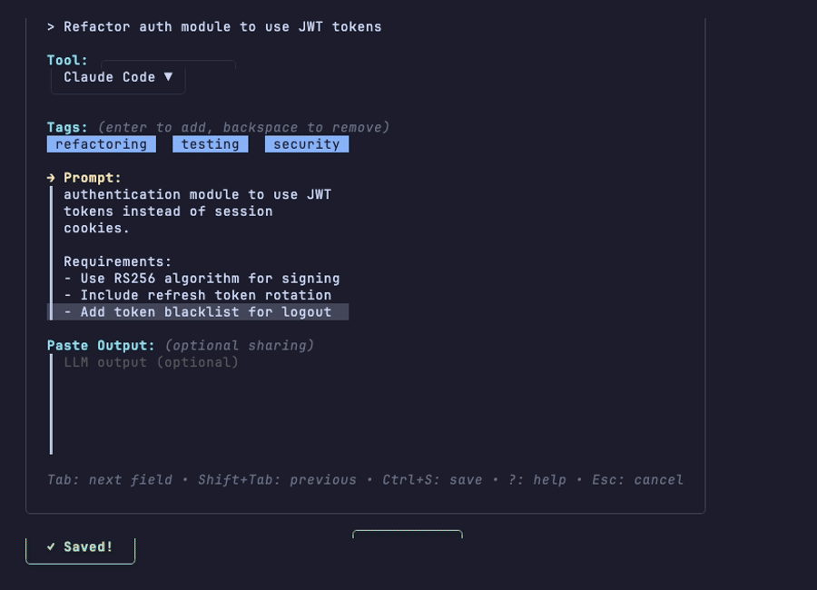

# prompt-share

[](https://github.com/rsnodgrass/prompt-share/releases)
[](https://github.com/rsnodgrass/prompt-share/actions)
[](LICENSE)

A beautiful TUI tool for teams to capture and share AI prompts, creating a collaborative learning resource in your repo.



## Features

- **Capture-as-you-go** - Minimal friction prompt capture workflow
- **Beautiful TUI** - Catppuccin-inspired terminal interface
- **10+ AI tools** - Claude Code, Cursor, Kiro, ChatGPT, Copilot, Warp AI, Windsurf, Aider, Gemini, Perplexity
- **Auto-generated metadata** - Timestamp, author (from git), title
- **Tag autocomplete** - From existing prompts in your repo
- **README generation** - Auto-generate prompt index for discovery

## Installation

### macOS & Linux (Homebrew)

```bash
brew install rsnodgrass/tap/prompt-share
```

### Windows (Scoop)

```bash
scoop bucket add rsnodgrass https://github.com/rsnodgrass/scoop-bucket
scoop install prompt-share
```

### Go

```bash
go install github.com/rsnodgrass/prompt-share/cmd/prompt-share@latest
```

### Binary Downloads

Download pre-built binaries from [Releases](https://github.com/rsnodgrass/prompt-share/releases).

### From Source

```bash
git clone https://github.com/rsnodgrass/prompt-share.git
cd prompt-share
make install
```

## Quick Start

```bash
# Initialize prompts directory in your repo
prompt-share init

# Capture a new prompt
prompt-share

# Generate README index of all prompts
prompt-share readme
```

## Usage

```bash
prompt-share              # Launch TUI to capture a prompt
prompt-share init         # Create learning/prompts/ directory
prompt-share readme       # Generate/update prompt index
prompt-share config       # Open config in $EDITOR
prompt-share -t Cursor    # Override default tool
prompt-share --stay       # Capture multiple prompts
prompt-share -v           # Show version
```

## Configuration

Config file: `~/.config/prompt-share/config.yaml`

```yaml
default_tool: Claude Code
custom_tools:
  - Internal GPT
  - Custom Model
favorite_tags:
  - debugging
  - design
  - refactoring
output_dir: learning/prompts
```

## Keyboard Shortcuts

| Key | Action |
|-----|--------|
| `Tab` | Next field |
| `Shift+Tab` | Previous field |
| `Ctrl+S` | Save and exit |
| `Esc` | Cancel and exit |
| `/` | Open tool selector |
| `?` | Show help |

## License

[MIT](LICENSE)
